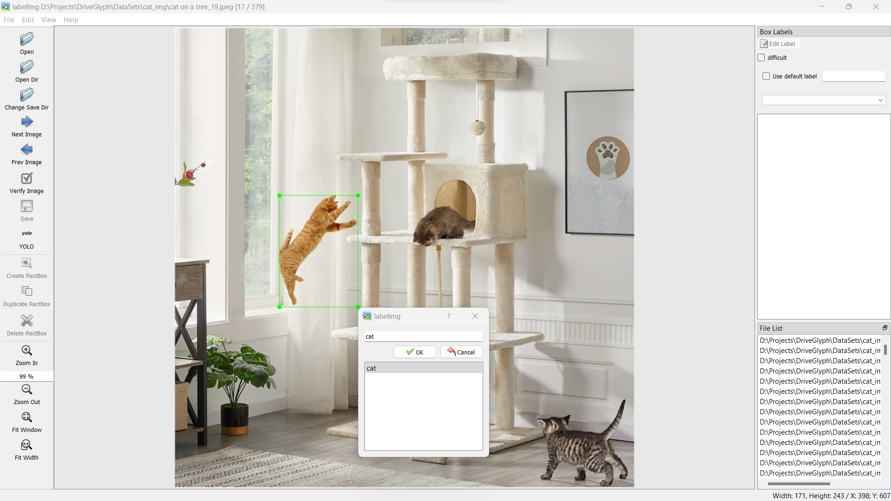
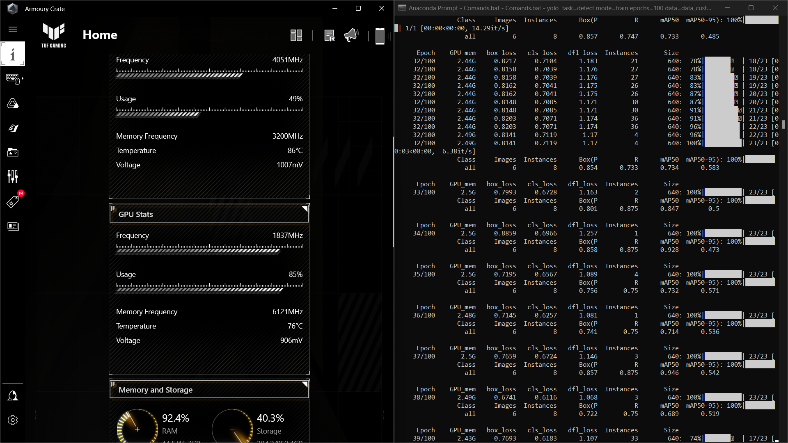

# DriveGlyph - Custom Object Detector

DriveGlyph is a deep learning-based custom object detector project that utilizes YOLOv8, PyTorch, and Python to detect objects in real-time as well as in imported images and videos. This README file provides an overview of the project, instructions to set it up, and demonstrates how to run the object detection script without using Anaconda Prompt. Additionally, example videos and photos showcasing the process and predicted objects are included.

## Table of Contents

- [Project Overview](#project-overview)
- [Installation](#installation)
- [Usage](#usage)
- [Example Videos and Photos](#example-videos-and-photos)
- [Contributing](#contributing)
- [License](#license)

## Project Overview

DriveGlyph is an object detection project based on YOLOv8, a state-of-the-art real-time object detection model. The project aims to detect objects, specifically cats in this case, using a custom-trained dataset comprising approximately 200 images.

Key Features:
- Real-time object detection
- Object detection in imported images and videos
- Displays object class, bounding box, and probability

Please note that this is the author's first deep learning project and is solely trained on a personal machine GPU.

## Installation

To run the DriveGlyph object detector project, please follow the installation instructions below:

1. Clone the repository:
   ```
   git clone https://github.com/ChatDil0/DriveGlyph.git
   ```
   Alternatively, you can download the repository as a ZIP file and extract it.

2. Install the required dependencies:
   - Anaconda
   - Python

   You can install Anaconda by following the instructions on the [Anaconda website](https://www.anaconda.com/products/individual).

3. Download the trained data:
   The trained data used for DriveGlyph can be downloaded from [link-to-trained-data](https://drive.google.com/drive/folders/1R3-6aH7y06TuC8rUn2-t4zMe99e56qFS?usp=sharing).

4. Place the downloaded trained data in the appropriate directory within the project.

## Usage

To run the DriveGlyph object detector project, please follow the steps below:

1. Open the command prompt or terminal.

2. Navigate to the project directory:
   ```
   cd /path/to/DriveGlyph
   ```

3. Run the object detection script:
   ```
   python object_detection.py
   ```

   This script will perform object detection on the default video file specified in the script. You can modify the script to use your desired video or image file for detection.

4. Observe the detected objects:
   The script will display the object class, bounding box coordinates, and probability of detection.

## Example Videos and Photos

To provide a visual representation of the DriveGlyph object detection process and predicted objects, please refer to the following examples:

<u>Labeling</u>



<u>Trainig</u>



<u>Imported file object detecting</u>


These examples demonstrate the real-time object detection capabilities of DriveGlyph and showcase the accuracy of the model.

## License

The DriveGlyph project is open-source and distributed under the [MIT License](LICENSE). Feel free to use, modify, and distribute the code according to the terms of the license.

## Acknowledgments

DriveGlyph is built upon the YOLOv8 implementation by Joseph Redmon and the PyTorch framework. We acknowledge the contributions of the open-source community in enabling the development of this project.

## Contributing

Contributions to the DriveGlyph project are welcome! If you have any questions or need further assistance, please contact me at chathurar.99.bc@gmail.com.

Thank you for using DriveGlyph!
